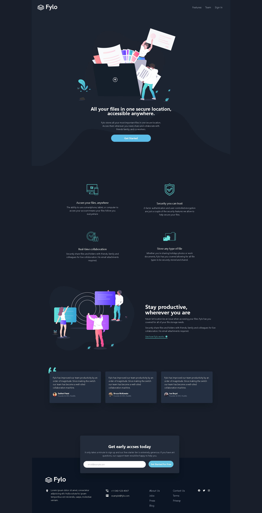

# Fylo-dark-theme-landing-page

# Frontend Mentor - Fylo dark theme landing page solution

This is a solution to the [Fylo dark theme landing page challenge on Frontend Mentor](https://www.frontendmentor.io/challenges/fylo-dark-theme-landing-page-5ca5f2d21e82137ec91a50fd). Frontend Mentor challenges help you improve your coding skills by building realistic projects. 

## Table of contents

- [Overview](#overview)
  - [The challenge](#the-challenge)
  - [Screenshot](#screenshot)
  - [Links](#links)
- [My process](#my-process)
  - [Built with](#built-with)
  - [What I learned](#what-i-learned)
  - [Continued development](#continued-development)
  - [Useful resources](#useful-resources)
- [Author](#author)

## Overview

### The challenge

Users should be able to:

- View the optimal layout for the site depending on their device's screen size
- See hover states for all interactive elements on the page

### Screenshot

### Links

- Live Site URL: [https://dainty-mousse-203294.netlify.app/](https://dainty-mousse-203294.netlify.app/)

## My process

### Built with

- Semantic HTML5 markup
- CSS custom properties
- Flexbox
- CSS Grid
- Mobile-first workflow
- [Tailwind CSS](https://tailwindcss.com/) - CSS framework
- Vanilla JavaScript

### What I learned

This was my first time using Tailwind CSS. I just opened the docs and I just did it by looking there and this project was the first time i properly use responsive design and Mobile-first workflow.

### Continued development

I will continue to work on my CSS and responsive design skills with Tailwind CSS. For my next project, I will pick something i can practice my JS skills. 

### Useful resources

- [Tailwind CSS Docs](https://tailwindcss.com/docs/installation)

## Author

- Frontend Mentor - [@Mustafacmn](https://www.frontendmentor.io/profile/Mustafacmn)
- Twitter - [@beginnercoderr](https://twitter.com/beginnercoderr)

